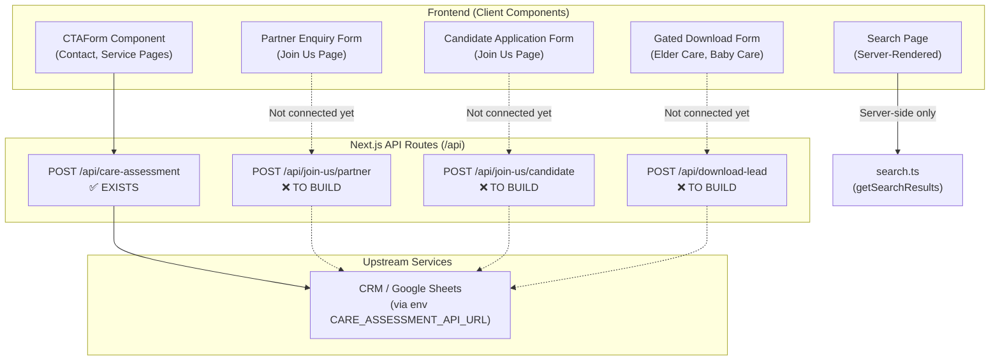

# 📋 Narpavi Homecare — API Documentation

> **Application**: Narpavi Homecare (Next.js 16 / App Router)
> **Base URL**: `https://www.narpavihomecare.com`
> **Version**: 0.1.0
> **Last Updated**: 2026-07-24

---

## Table of Contents

1. [Overview](#overview)
2. [Existing APIs](#existing-apis)
   - [Care Assessment Enquiry](#1-care-assessment-enquiry)
3. [Proposed APIs (Not Yet Built)](#proposed-apis-not-yet-built)
   - [Partner Enquiry](#2-partner-enquiry)
   - [Candidate Application](#3-candidate-application)
   - [Gated Resource Download](#4-gated-resource-download)
   - [Contact Form (General Enquiry)](#5-contact-form-general-enquiry)
   - [Search API](#6-search-api)
4. [Pages & Data Endpoints Summary](#pages--data-endpoints-summary)
5. [Environment Variables](#environment-variables)
6. [Error Response Format](#error-response-format)

---

## Overview

Narpavi Homecare is a professional home healthcare services website serving Chennai, Tamil Nadu. The app is a **Next.js 16 App Router** project with:

- **Frontend Pages**: Home, Services (4 packages), Home Nursing Care (5 sub-services), Baby Care, Elder Care, Medical Equipment (10 categories), Blog, FAQ, Contact, Join Us, Search, About, Privacy, Terms, Resources
- **Existing API Route**: 1 (Care Assessment)
- **Forms that need APIs**: 3 (Partner Enquiry, Candidate Application, Gated Download)

---

## Existing APIs

### 1. Care Assessment Enquiry

> [!NOTE]
> This is the **only existing API** in the application. It is used by the `CTAForm` component which appears on the Contact page and across multiple service pages.

**Endpoint**: `POST /api/care-assessment`

**Source File**: [route.ts](file:///c:/Users/dell/Videos/Basic%20Nursing%20Care%20Finals/narpavi-homecare/src/app/api/care-assessment/route.ts)

**Used By**: [CTAForm.tsx](file:///c:/Users/dell/Videos/Basic%20Nursing%20Care%20Finals/narpavi-homecare/src/components/ui/CTAForm.tsx) (Contact page, all service pages with care assessment forms)

#### Request

```
POST /api/care-assessment
Content-Type: application/json
```

```json
{
  "name": "Ramesh Kumar",
  "countryCode": "+91",
  "phone": "9876543210",
  "phoneFull": "+91 9876543210",
  "city": "Chennai",
  "serviceStartDate": "2026-08-01",
  "packageName": "Active Assist",
  "enquiryFor": "Basic Nursing Care",
  "sourcePath": "/basic-nursing-care",
  "submittedAt": "2026-07-24T22:30:00.000Z"
}
```

| Field | Type | Required | Description |
|---|---|---|---|
| `name` | `string` | ✅ **Yes** | Full name of the person making the enquiry |
| `countryCode` | `string` | No | Country calling code (e.g., `+91`). Default: empty |
| `phone` | `string` | ✅ **Yes** | Mobile phone number (without country code) |
| `phoneFull` | `string` | No | Auto-computed as `{countryCode} {phone}` if not provided |
| `city` | `string` | ✅ **Yes** | City or location of the patient |
| `serviceStartDate` | `string` | No | Preferred start date in `YYYY-MM-DD` format |
| `packageName` | `string` | No | Selected care package name (e.g., `Active Assist`, `Guided Living`, `Caring Hands`, `Comfort Plus`, `Customize`) |
| `enquiryFor` | `string` | ✅ **Yes** | Service category the enquiry is for |
| `sourcePath` | `string` | No | URL path where the form was submitted from (e.g., `/contact`, `/basic-nursing-care`) |
| `submittedAt` | `string` | No | ISO 8601 timestamp. Auto-set to `new Date().toISOString()` if not provided |

**Possible `enquiryFor` values** (auto-resolved from the page URL or form title):

| Value | Source Page |
|---|---|
| `Basic Nursing Care` | `/basic-nursing-care` |
| `Baby Care` | `/baby-care/*` |
| `Elder Care` | `/elder-care/*` |
| `Medical Equipment` | `/medical-equipment` |
| `Patient Assistant Care` | `/home-nursing-care/patient-assistant-care` |
| `Advance Nursing Care` | `/home-nursing-care/advance-nursing-care/*` |
| `Specialty Nursing Care` | `/home-nursing-care/specialty-nursing-care` |
| `ICU at Home` | `/home-nursing-care/icu-at-home` |
| `End of Life Care` | `/home-nursing-care/end-of-life-care` |
| `Home Nursing Care` | `/home-nursing-care` |
| `Care Assessment` | `/contact` |

**Possible `packageName` values** (for Basic Nursing Care):

- `Active Assist`
- `Guided Living`
- `Caring Hands`
- `Comfort Plus`
- `Customize`

#### Response — Success (`200 OK`)

```json
{
  "ok": true,
  "enquiryFor": "Basic Nursing Care",
  "forwarded": true
}
```

| Field | Type | Description |
|---|---|---|
| `ok` | `boolean` | Always `true` on success |
| `enquiryFor` | `string` | Echoed back from the request |
| `forwarded` | `boolean` | `true` if the env var `CARE_ASSESSMENT_API_URL` was set and data was forwarded to the upstream API |

#### Response — Validation Error (`400 Bad Request`)

```json
{
  "ok": false,
  "message": "Missing required fields",
  "missingFields": ["name", "phone"]
}
```

#### Response — Invalid Payload (`400 Bad Request`)

```json
{
  "ok": false,
  "message": "Invalid enquiry payload"
}
```

#### Response — Upstream Failure (`502 Bad Gateway`)

```json
{
  "ok": false,
  "message": "Unable to forward enquiry"
}
```

> [!IMPORTANT]
> The API forwards the normalized payload to an **upstream URL** configured via the `CARE_ASSESSMENT_API_URL` environment variable. If this env var is not set, the API still returns success but with `forwarded: false`.

---

## Proposed APIs (Not Yet Built)

> [!WARNING]
> The following APIs are **not yet implemented**. The frontend forms exist in the code, but they currently do `event.preventDefault()` without making any API calls. These need to be built.

---

### 2. Partner Enquiry

**Proposed Endpoint**: `POST /api/join-us/partner`

**Form Location**: [JoinUsExperience.tsx](file:///c:/Users/dell/Videos/Basic%20Nursing%20Care%20Finals/narpavi-homecare/src/components/sections/JoinUsExperience.tsx) → Partner Enquiry Form (lines 202–252)

**Current Status**: ❌ Form only does `event.preventDefault()` — no API call

#### Request

```
POST /api/join-us/partner
Content-Type: application/json
```

```json
{
  "contactName": "Dr. Sunitha",
  "organization": "Apollo Clinic",
  "partnerType": "Hospital / Clinic",
  "countryCode": "+91",
  "phone": "9876543210",
  "email": "sunitha@apolloclinic.com",
  "location": "Chennai",
  "message": "We would like to refer patients who need post-discharge homecare.",
  "sourcePath": "/join-us",
  "submittedAt": "2026-07-24T22:30:00.000Z"
}
```

| Field | Type | Required | Description |
|---|---|---|---|
| `contactName` | `string` | ✅ **Yes** | Contact person's full name |
| `organization` | `string` | ✅ **Yes** | Company / institution name |
| `partnerType` | `string` | ✅ **Yes** | Type of partner organization |
| `countryCode` | `string` | No | Country code (default: `+91`) |
| `phone` | `string` | ✅ **Yes** | Phone number |
| `email` | `string` | ✅ **Yes** | Business email address |
| `location` | `string` | ✅ **Yes** | City or service operating area |
| `message` | `string` | No | Free-text description of partnership idea |
| `sourcePath` | `string` | No | URL path (auto-set) |
| `submittedAt` | `string` | No | ISO 8601 timestamp |

**Possible `partnerType` values**:

- `Hospital / Clinic`
- `Doctor / Healthcare Professional`
- `Corporate / Insurance`
- `NGO / Community Organization`
- `Pharmacy / Medical Equipment`
- `Referral / Service Partner`
- `Other`

#### Response — Success (`200 OK`)

```json
{
  "ok": true,
  "type": "partner",
  "message": "Partner enquiry submitted successfully"
}
```

#### Response — Validation Error (`400 Bad Request`)

```json
{
  "ok": false,
  "message": "Missing required fields",
  "missingFields": ["contactName", "email"]
}
```

---

### 3. Candidate Application

**Proposed Endpoint**: `POST /api/join-us/candidate`

**Form Location**: [JoinUsExperience.tsx](file:///c:/Users/dell/Videos/Basic%20Nursing%20Care%20Finals/narpavi-homecare/src/components/sections/JoinUsExperience.tsx) → Candidate Application Form (lines 254–328)

**Current Status**: ❌ Form only does `event.preventDefault()` — no API call

#### Request

```
POST /api/join-us/candidate
Content-Type: multipart/form-data
```

```
------FormBoundary
Content-Disposition: form-data; name="name"
Priya Sharma

------FormBoundary
Content-Disposition: form-data; name="countryCode"
+91

------FormBoundary
Content-Disposition: form-data; name="phone"
9876543210

------FormBoundary
Content-Disposition: form-data; name="email"
priya@example.com

------FormBoundary
Content-Disposition: form-data; name="role"
ANM / GNM Nurse

------FormBoundary
Content-Disposition: form-data; name="experience"
1–3 years

------FormBoundary
Content-Disposition: form-data; name="shift"
12 Hours

------FormBoundary
Content-Disposition: form-data; name="location"
Anna Nagar, Chennai

------FormBoundary
Content-Disposition: form-data; name="message"
Experienced in post-surgical care and elder support.

------FormBoundary
Content-Disposition: form-data; name="resume"; filename="priya_resume.pdf"
Content-Type: application/pdf
<binary data>
------FormBoundary--
```

| Field | Type | Required | Description |
|---|---|---|---|
| `name` | `string` | ✅ **Yes** | Candidate's full name |
| `countryCode` | `string` | No | Country code (default: `+91`) |
| `phone` | `string` | ✅ **Yes** | Phone number |
| `email` | `string` | ✅ **Yes** | Email address |
| `role` | `string` | ✅ **Yes** | Role applying for |
| `experience` | `string` | ✅ **Yes** | Experience level |
| `shift` | `string` | No | Preferred work shift |
| `location` | `string` | ✅ **Yes** | Current city / area |
| `message` | `string` | No | Brief self-description |
| `resume` | `File` | No | Resume/CV file (`.pdf`, `.doc`, `.docx`) |
| `sourcePath` | `string` | No | URL path (auto-set) |
| `submittedAt` | `string` | No | ISO 8601 timestamp |

**Possible `role` values**:

- `Trained Caregiver`
- `Patient Care Assistant`
- `ANM / GNM Nurse`
- `B.Sc Nursing Graduate`
- `Physiotherapist`
- `Fresher / Training Applicant`

**Possible `experience` values**:

- `Fresher`
- `Less than 1 year`
- `1–3 years`
- `3–5 years`
- `More than 5 years`

**Possible `shift` values**:

- `4 Hours`
- `8 Hours`
- `12 Hours`
- `24 Hours`
- `Live-In`
- `Flexible`

#### Response — Success (`200 OK`)

```json
{
  "ok": true,
  "type": "candidate",
  "message": "Candidate application submitted successfully"
}
```

#### Response — Validation Error (`400 Bad Request`)

```json
{
  "ok": false,
  "message": "Missing required fields",
  "missingFields": ["name", "role"]
}
```

---

### 4. Gated Resource Download

**Proposed Endpoint**: `POST /api/download-lead`

**Form Location**: [GatedDownloadResources.tsx](file:///c:/Users/dell/Videos/Basic%20Nursing%20Care%20Finals/narpavi-homecare/src/components/sections/GatedDownloadResources.tsx) → Modal download form (lines 120–127)

**Current Status**: ⚠️ Form collects lead data but **directly triggers a file download without saving the lead** — no API call

#### Request

```
POST /api/download-lead
Content-Type: application/json
```

```json
{
  "name": "Meena",
  "mobile": "9876543210",
  "profession": "Family Caregiver",
  "downloadTitle": "Elder Care Planning Guide",
  "downloadFileUrl": "/downloads/elder-care-guide.docx",
  "sourcePath": "/elder-care",
  "submittedAt": "2026-07-24T22:30:00.000Z"
}
```

| Field | Type | Required | Description |
|---|---|---|---|
| `name` | `string` | ✅ **Yes** | Name of the person |
| `mobile` | `string` | ✅ **Yes** | Mobile phone number |
| `profession` | `string` | ✅ **Yes** | Profession / role |
| `downloadTitle` | `string` | No | Title of the resource being downloaded |
| `downloadFileUrl` | `string` | No | URL/path to the downloadable file |
| `sourcePath` | `string` | No | Page from which download was requested |
| `submittedAt` | `string` | No | ISO 8601 timestamp |

#### Response — Success (`200 OK`)

```json
{
  "ok": true,
  "message": "Lead captured successfully",
  "downloadUrl": "/downloads/elder-care-guide.docx"
}
```

#### Response — Validation Error (`400 Bad Request`)

```json
{
  "ok": false,
  "message": "Missing required fields",
  "missingFields": ["name", "mobile"]
}
```

---

### 5. Contact Form (General Enquiry)

> [!TIP]
> The Contact page currently uses the **same `CTAForm`** component, which calls the existing `/api/care-assessment` endpoint. This is already working. A separate general-purpose contact API is **not needed** unless you want a different workflow for general enquiries (e.g., without package/service selection).

**Currently Handled By**: `POST /api/care-assessment` with `enquiryFor: "Care Assessment"`

---

### 6. Search API

> [!TIP]
> Search is currently handled **server-side** within the [search page](file:///c:/Users/dell/Videos/Basic%20Nursing%20Care%20Finals/narpavi-homecare/src/app/search/page.tsx) component using the `getSearchResults()` function from [search.ts](file:///c:/Users/dell/Videos/Basic%20Nursing%20Care%20Finals/narpavi-homecare/src/lib/search.ts). It does **NOT** use a separate API route — the search is a standard server-rendered page with a `?q=` query parameter.

**Current Behaviour**: `GET /search?q=oxygen` → Server-side rendered page

**If a JSON API is needed** (for auto-suggest, instant search, etc.):

**Proposed Endpoint**: `GET /api/search?q={query}&limit={limit}`

#### Request

```
GET /api/search?q=oxygen&limit=8
```

| Parameter | Type | Required | Default | Description |
|---|---|---|---|---|
| `q` | `string` | No | `""` | Search query keyword |
| `limit` | `number` | No | `12` | Max number of results to return |

#### Response — Success (`200 OK`)

```json
{
  "ok": true,
  "query": "oxygen",
  "count": 3,
  "results": [
    {
      "title": "Oxygen Cylinder",
      "excerpt": "Medical grade oxygen cylinders for home healthcare use.",
      "href": "/medical-equipment/oxygen-cylinder",
      "type": "Equipment"
    },
    {
      "title": "Respiratory Equipment",
      "excerpt": "Explore respiratory equipment support from Narpavi Homecare.",
      "href": "/medical-equipment/respiratory-equipment",
      "type": "Service"
    }
  ]
}
```

---

## Pages & Data Endpoints Summary

The following pages exist in the application. All serve **server-rendered HTML** (no JSON API needed):

| Page | Route | Data Source |
|---|---|---|
| Home | `/` | Static + [packages.ts](file:///c:/Users/dell/Videos/Basic%20Nursing%20Care%20Finals/narpavi-homecare/src/lib/packages.ts) |
| Basic Nursing Care | `/basic-nursing-care` | [packages.ts](file:///c:/Users/dell/Videos/Basic%20Nursing%20Care%20Finals/narpavi-homecare/src/lib/packages.ts) |
| Home Nursing Care | `/home-nursing-care` | [homeNursingCareData.ts](file:///c:/Users/dell/Videos/Basic%20Nursing%20Care%20Finals/narpavi-homecare/src/lib/homeNursingCareData.ts) |
| Patient Assistant Care | `/home-nursing-care/patient-assistant-care` | homeNursingCareData |
| Advance Nursing Care | `/home-nursing-care/advance-nursing-care` | [advanceNursingCareData.ts](file:///c:/Users/dell/Videos/Basic%20Nursing%20Care%20Finals/narpavi-homecare/src/lib/advanceNursingCareData.ts) |
| Specialty Nursing Care | `/home-nursing-care/specialty-nursing-care` | [specialtyNursingCareData.ts](file:///c:/Users/dell/Videos/Basic%20Nursing%20Care%20Finals/narpavi-homecare/src/lib/specialtyNursingCareData.ts) |
| ICU at Home | `/home-nursing-care/icu-at-home` | [icuAtHomeData.ts](file:///c:/Users/dell/Videos/Basic%20Nursing%20Care%20Finals/narpavi-homecare/src/lib/icuAtHomeData.ts) |
| Baby Care | `/baby-care` | [babyCareData.ts](file:///c:/Users/dell/Videos/Basic%20Nursing%20Care%20Finals/narpavi-homecare/src/lib/babyCareData.ts) |
| Elder Care | `/elder-care` | [elderCareData.ts](file:///c:/Users/dell/Videos/Basic%20Nursing%20Care%20Finals/narpavi-homecare/src/lib/elderCareData.ts) |
| Medical Equipment | `/medical-equipment` | [equipment.ts](file:///c:/Users/dell/Videos/Basic%20Nursing%20Care%20Finals/narpavi-homecare/src/lib/equipment.ts) |
| Blog | `/blog` | [blogs.ts](file:///c:/Users/dell/Videos/Basic%20Nursing%20Care%20Finals/narpavi-homecare/src/lib/blogs.ts) |
| FAQ | `/faq` | [faqs.ts](file:///c:/Users/dell/Videos/Basic%20Nursing%20Care%20Finals/narpavi-homecare/src/lib/faqs.ts) |
| Contact | `/contact` | Static + CTAForm |
| Join Us | `/join-us` | Static + JoinUsExperience |
| Search | `/search?q=...` | [search.ts](file:///c:/Users/dell/Videos/Basic%20Nursing%20Care%20Finals/narpavi-homecare/src/lib/search.ts) |
| Resources | `/resources` | [deliverables.ts](file:///c:/Users/dell/Videos/Basic%20Nursing%20Care%20Finals/narpavi-homecare/src/lib/deliverables.ts) |
| About | `/about` | Static |
| Privacy | `/privacy` | Static |
| Terms | `/terms` | Static |
| Service Packages | `/services/active-assist`, `/services/guided-living`, `/services/caring-hands`, `/services/comfort-plus` | [packages.ts](file:///c:/Users/dell/Videos/Basic%20Nursing%20Care%20Finals/narpavi-homecare/src/lib/packages.ts) |
| Sitemap | `/sitemap.xml` | [sitemap.ts](file:///c:/Users/dell/Videos/Basic%20Nursing%20Care%20Finals/narpavi-homecare/src/app/sitemap.ts) |
| Robots | `/robots.txt` | [robots.ts](file:///c:/Users/dell/Videos/Basic%20Nursing%20Care%20Finals/narpavi-homecare/src/app/robots.ts) |

---

## Environment Variables

| Variable | Required | Description |
|---|---|---|
| `CARE_ASSESSMENT_API_URL` | No | Upstream URL to forward care assessment enquiries to (e.g., Google Sheets webhook, CRM endpoint). If not set, the API returns success without forwarding. |

> [!IMPORTANT]
> For the proposed new APIs (Partner, Candidate, Download Lead), you will likely need similar environment variables:
> - `PARTNER_ENQUIRY_API_URL` — Upstream endpoint for partner enquiries
> - `CANDIDATE_APPLICATION_API_URL` — Upstream endpoint for candidate applications
> - `DOWNLOAD_LEAD_API_URL` — Upstream endpoint for download lead capture

---

## Error Response Format

All API errors follow a consistent format:

```json
{
  "ok": false,
  "message": "Human-readable error description",
  "missingFields": ["field1", "field2"]
}
```

| Field | Type | Present | Description |
|---|---|---|---|
| `ok` | `boolean` | Always | Always `false` on error |
| `message` | `string` | Always | Error description |
| `missingFields` | `string[]` | Only on validation errors | List of missing required field names |

### HTTP Status Codes Used

| Code | Meaning | When |
|---|---|---|
| `200` | Success | Enquiry submitted successfully |
| `400` | Bad Request | Missing required fields or invalid JSON payload |
| `502` | Bad Gateway | Upstream API call failed |

---

## API Architecture Diagram



---

## Summary — What Needs To Be Built

| # | API | Status | Priority |
|---|---|---|---|
| 1 | `POST /api/care-assessment` | ✅ **Done** | — |
| 2 | `POST /api/join-us/partner` | ❌ **Needs route + form wiring** | 🔴 High |
| 3 | `POST /api/join-us/candidate` | ❌ **Needs route + form wiring** | 🔴 High |
| 4 | `POST /api/download-lead` | ❌ **Needs route + form wiring** | 🟡 Medium |
| 5 | `GET /api/search` | 🟢 **Optional** (server rendering works) | 🟢 Low |
